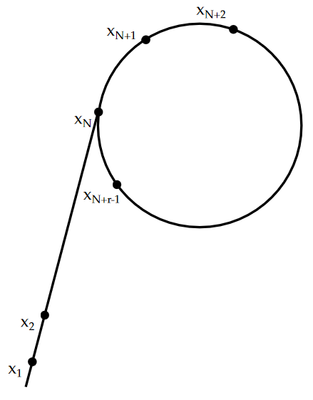
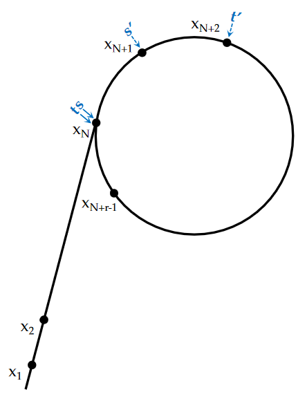
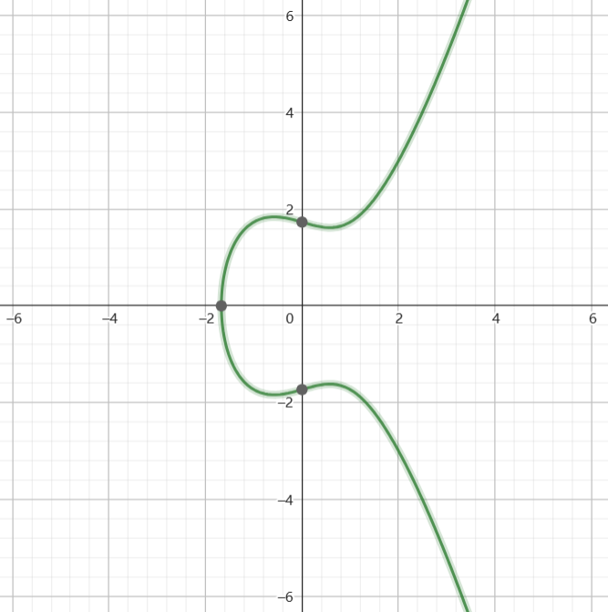

<div class="cover" style="page-break-after:always;font-family:方正公文仿宋;width:100%;height:100%;border:none;margin: 0 auto;text-align:center;">
    <div style="width:60%;margin: 0 auto;height:0;padding-bottom:10%;">
        </br>
        
    </div>
    </br></br></br></br></br>
    <div style="width:60%;margin: 0 auto;height:0;padding-bottom:40%;">
        
	</div>
    </br></br></br></br></br></br></br></br>
    <span style="font-family:华文黑体Bold;text-align:center;font-size:20pt;margin: 10pt auto;line-height:30pt;">基于量子计算的RSA加密算法破解</span>
    <p style="text-align:center;font-size:14pt;margin: 0 auto">《网络空间安全导论》课程论文 </p>
    </br>
    </br>
    <table style="border:none;text-align:center;width:72%;font-family:仿宋;font-size:14px; margin: 0 auto;">
    <tbody style="font-family:方正公文仿宋;font-size:12pt;">
    	<tr style="font-weight:normal;"> 
    		<td style="width:20%;text-align:right;">题　　目</td>
    		<td style="width:2%">：</td> 
    		<td style="width:40%;font-weight:normal;border-bottom: 1px solid;text-align:center;font-family:华文仿宋"> 基于量子计算的RSA加密算法破解</td>     </tr>
        <tr style="font-weight:normal;"> 
    		<td style="width:20%;text-align:right;">姓名学号</td>
    		<td style="width:2%">：</td> 
    		<td style="width:40%;font-weight:normal;border-bottom: 1px solid;text-align:center;font-family:华文仿宋"> xxx	xxx</td>     </tr>
    	<tr style="font-weight:normal;"> 
    		<td style="width:20%;text-align:right;"></td>
    		<td style="width:2%"></td> 
    		<td style="width:40%;font-weight:normal;border-bottom: 1px solid;text-align:center;font-family:华文仿宋"> xxx	xxx </td>     </tr>
         <tr style="font-weight:normal;"> 
    		<td style="width:20%;text-align:right;"></td>
    		<td style="width:2%"></td> 
    		<td style="width:40%;font-weight:normal;border-bottom: 1px solid;text-align:center;font-family:华文仿宋"> xxx	xxx </td>     </tr>
    	<tr style="font-weight:normal;"> 
    		<td style="width:20%;text-align:right;">日　　期</td>
    		<td style="width:2%">：</td> 
    		<td style="width:40%;font-weight:normal;border-bottom: 1px solid;text-align:center;font-family:华文仿宋">2023年6月18日</td>     </tr>
    </tbody>              
    </table>
</div>


<!--  -->


# 基于量子计算的RSA加密算法破解

<center><div style='height:2mm;'></div><div style="font-family:华文楷体;font-size:14pt;">xxx，xxx，xxx</div></center>
<div>
<div style="width:52px;float:left; font-family:方正公文黑体;">摘　要：</div> 
<div style="overflow:hidden; font-family:华文楷体;">破解RSA加密算法的关键在于质因数的分解。本文分别对经典质因数分解算法和量子shor算法进行分析，着重介绍量子shor算法的原理并给出模指电路的一种合理构造。</div>
</div>
<div>
<div style="width:52px;float:left; font-family:方正公文黑体;">关键词：</div> 
<div style="overflow:hidden; font-family:华文楷体;">RSA;shor算法;量子计算</div>
</div>


<!-- -->


# 目录

[TOC]


## RSA加密算法简述

### 原理^[1]^

#### 密钥计算方法

1.  选择两个大素数p和q
2.  计算 $ n = p \times q$  和 $ z = (p - 1) \times (q - 1)$  , n表示欧拉函数
3.  选择一个与 z 互质的数，令其为e（随机选取）
4.  找到一个 d 满足 $e \times d  \equiv  1(mod \ z)$
5.  公钥为$(e,n)$ ，私钥为$(d,n)$

#### 加密方法

1. 将明文看成比特串，将明文划分成$|plaintext|$位,将每一个字符转化为对应的ASCII码
2. 对每一个数据块P，计算

$$
C = P ^e (mod \ n)
$$

​	C 即为P的密文。

#### 解密方法

​	对每一个密文块 C ，计算
$$
P = C^d (mod \ n)
$$

​	P 即为C的明文。

### 算法实现

```c
int isprime(int n) {
  for (int i = 2; i * i <= n; i++) {
    if (!(n % i))
      return 0;
  }
  return 1;
}

int qpow(int a, int b, int p) {
  int res = 1 % p;
  for (; b; b >>= 1) {
    if (b & 1)
      res = (long long)res * a % p;
    a = (long long)a * a % p;
  }
  return res;
}

int gcd(int n, int m) { return n ? gcd(m % n, n) : m; }

void exgcd(int a, int b, int *x, int *y) {
  if (b == 0) {
    *x = 1, *y = 0;
    return;
  }
  exgcd(b, a % b, x, y);
  int z = *x;
  *x = *y;
  *y = z - (a / b) * (*y);
}

int getrand(int p, int q) {
  int z = (p - 1) * (q - 1);
  while (1) {
    int e = rand() % z;
    if (gcd(e, z) == 1)
      return e;
  }
}

int secret_key(int e, int z) {
  int x, y;
  exgcd(e, z, &x, &y);
  return (x % z + z) % z;
}

void encrypt(int e, int n) {
  char plaintext[100];
  printf("input plaintext:\n");
  scanf("%s", plaintext);
  size = strlen(plaintext);
  int plainASCII[size];
  for (int i = 0; i < size; i++)
    plainASCII[i] = (int)plaintext[i];
  for (int i = 0; i < size; i++)
    ciphertext[i] = qpow(plainASCII[i], e, n);
  printf("ciphertext is:\n");
  for (int i = 0; i < size; i++) {
    printf("%d", ciphertext[i]);
  }
}

void decrypt(int d, int n) {
  int de_plaintextASCII[size];
  char de_plain[size];
  for (int i = 0; i < size; i++)
    de_plaintextASCII[i] = qpow(ciphertext[i], d, n);
  printf("plaintext is:\n");
  for (int i = 0; i < size; i++) {
    de_plain[i] = (char)de_plaintextASCII[i];
    printf("%c", de_plain[i]);
  }
}
```

## 经典破解方法

### Pollard rho算法

#### 概述

Pollard rho算法是一种随机算法，用于在期望复杂度$O(n^{\frac{1}{4}})$找到合数n的一个非平凡因子。

通过对$(1,n)$中整数的随机选取，若得到的整数m满足$(m,n)\triangleq d\not=1$，则有$d\mid n$，即得到n的一个非平凡因子d.考虑到最坏情况为$n=p^2$（其中p为质数），此时n的非平凡因子仅有p，符合条件的m为
$$
p,2p,3p,\cdots,(p-1)p
$$
约为$p-1\approx\sqrt n$，考虑到求最大公因数时复杂度为$O(\log n)$，最终期望复杂度为$O(\sqrt{n}\log n)$.

而pollard rho算法巧妙构造伪随机数生成器，实现降低复杂度的效果。

#### 原理

##### 生日悖论

生日悖论可以表述为：“若一个房间中有23个人，则他们中有两个人生日相同的概率大于50%.”旨在告诉我们在某一个范围内生成随机整数，将很快生成重复的数字。可以证明，对于一个生成$[1,N]$内整数的随机数生成器，期望为^[2]^
$$
E[X]=\sqrt{\dfrac{\pi N}{2}}
$$

考虑到上述最坏情况，因子$p$将$(1,n)$中整数划分为p个模p同余类
$$
\bar i=\{z\in Z|z\equiv i\ (mod\ p)\},i=0,1,\cdots,p-1
$$
则期望随机生成约$\sqrt p$个随机数后，将出现两个模p同余的数，记作$i,j$，有
$$
\begin{array}{l}
& i\equiv j\ (mod\ p)\\
\Rightarrow&i-j\equiv 0\ (mod\ p)\\
\Rightarrow&p\mid i-j
\end{array}
$$
又$(n,p)\not=1$，故$(n,i-j)\not=1$，$i-j$符合条件，可求得n的非平凡因子。

但上述悖论无法直接运用到随机化过程中，该过程要求对所有的随机数进行两两比较，复杂度退化至$O(\sqrt n\log n)$.

##### 伪随机数生成器

构造
$$
f(x)\triangleq(x^2+c)\mod N
$$
设定序列初始值为$x_0$，则关于参数c的伪随机数序列为
$$
\pi\triangleq\{x_0,f(x_0),f(f(x_0)),\cdots,\}
$$
伪随机数生成函数f(x)具有以下性质：

`定理1` （循环性）$\exist r\in\N^+\quad s.t.\exist N\in\N^+,\forall\ n\geqslant N,\pi_n=\pi_{n+r}$.

> **证**	由于$f(x)$取值有限，由抽屉原理知序列必存在重复数字；又该序列中每个元素由上一个元素生成，显然构成循环，如图（称为rho-图）：
>
> 

当进入循环后，应立即中断当前迭代进程，转而变更参数c的值继续寻找符合条件的$i,j$。

`定理2` （传递性）$|i-j|\equiv0(mod\ p)\Rightarrow|f(i)-f(j)|\equiv0(mod\ p)$

> **证**	$|f(i)-f(j)|=|i^2-j^2|=|i-j|\cdot|i+j|\equiv0(mod\ p)$

因此，我们可以按照i,j间的距离$|i-j|$为依据，将序列中的数对划分为多个等价类$[P]_R$，其中
$$
\begin{array}{l}
P_{ij}\triangleq(i,j)\\
R\triangleq\{(P_{ij},P_{kl})||i-j|\equiv|k-l|(mod\ p)\}
\end{array}
$$
当找到一组$(i,j)$满足同余条件$|i-j|\equiv0$时，该等价类中的所有数对都将满足条件；同理，若$(i,j)$不满足同余条件，则该等价类中的所有数对都将不满足条件。

所以我们只需依次检测每个等价类中的一个代表元，即可完成对所有生成的随机数的判断，将原先判断随机数的复杂度$O((\sqrt p)^2)=O(p)=O(\sqrt n)$降低到$O(\sqrt p)=O(n^{\frac{1}{4}})$.

##### Floyd判环算法

针对该随机数生成器的两个性质，设计如下算法：

设上述rho-图中有两个变量s,t，初始时s位于$x_1$处，t位于$x_2$处，代表所取的数对$P_{st}$.

若该数对满足同余条件，算法终止。否则按照如下规则进行更新：s前进一步，t前进两步，即
$$
\left\{
\begin{array}{l}
s'=f(s)\\t'=f(f(t))
\end{array}
\right.
$$

因此，经过一次更新后，$s,t$之间的距离将增加1，进行对下一个等价类合法性的检验。

同时，由于t每次比s多前进一步，若rho-图中存在环，则s,t最终会相遇。$s,t$相遇时意味着已经遇到环，如图：



遇到环后，$s,t$之间的距离d相当于重置为0，继续更新将导致距离d进入$1,2,\cdots,d-1,0$的循环中，应立即停止更新，并更换新的参数c开始新的一轮更新。

#### 算法实现

##### 算法步骤

1. 初始化：生成随机参数c，初始化序列初始值$x_0=0$，设定判环变量s,t初始值；
2. 判环：若s,t相等，则已进入环中，返回执行第一步重新进行初始化；
3. 更新答案：若$(t-s,n)\not=1$，则返回该最大公因数，即为合数n的一个非平凡因子；
4. 更新判环变量：根据算法原理，令$\left\{
   \begin{array}{l}
   s'=f(s)\\t'=f(f(t))
   \end{array}
   \right.$;更新后再次执行上述判环步骤.

可以证明，当c的选取完全随机时，期望复杂度为$O(n^{\frac{1}{4}}\log n)$.

##### 代码实现

```cpp
typedef long long ll;
template <typename T> T gcd(T n, T m) { return n ? gcd(m % n, n) : m; }
ll pollardRho(ll n) {
  while (1) {
    ll c = rand() % n;
    auto f = [=](ll x) { return ((__int128)x * x + c) % n; };
    ll s = f(0), t = f(f(0));
    while (s != t) {
      ll d = gcd(abs(s - t), n);
      if (d > 1)
        return d;
      s = f(s), t = f(f(t));
    }
  }
}
```

#### 实验结果

取p=19260817,q=998244353,N=p*q,运行结果如下


#### 算法优化

利用倍增法^[3]^优化s,t的更新策略，可将该算法继续优化至$O(n^{\frac{1}{4}})$.

### 连分式方法(CFRAC)

连分式方法 (Continued FRACtion)由 Morrison和 Brillhart于 1975年提出，且成功应用于 Fermat数$F_{7}$分解。

#### 原理

本方法基于如下事实
$$
x^{2}≡y^{2}~(mod~N)~~~~~x\not\equiv y~(mod~N)
$$
则易得$(N,x\pm y)$ 为 $N$的非平凡因子。

通过 CFRAC方法构造一组同余式
$$
x^{2}_{k}\equiv(-1)^{e_{0k}}p_{1}^{e_{1k}}...p_{m}^{e_{mk}}(mod~N)~~~~~~(1)
$$
其中 $p_{i}$为因子基 $FB$中较小的素数，如果找到足够多的同余式 ($n>m+1$)，则可利用二元域 $F_{2}$上的 $Gauss$消元法，可以找到组合系数 $\varepsilon_{k}∈F_{2}$使得：
$$
\sum_{k=1}^{n}\varepsilon_{k}(e_{0k},e_{1k},...,e_{mk})\equiv(0,0,...,0)~(mod~2)
$$
记
$$
(v_{0},...,v_{m})=\dfrac{1}{2}\sum_{k=1}^{n}\varepsilon_{k}(e_{0k},e_{1k},...,e_{mk})
$$
此时若令
$$
x=\prod_{k=1}^{n}x_{k}^{e_{k}},~y=(-1)^{v_{0}}\prod_{i=1}^{m}p_{i}^{v_{i}}~~~~~~(2)
$$
即可得
$$
x^{2}\equiv y^{2}~(mod~N)
$$
使用连分式部分展开式可以得到二次无理数 $\sqrt{KN}$ ($K∈N$)的有理数逼近。设 $\dfrac{P}{Q}$为其近似分数，则 $t=P^{2}-KNQ^{2}$的绝对值较小，从而 $t$很可能在因子基 $FB$下分解，同时 $P^{2}\equiv t~(mod~N)$，即能得到目标同余式 (1)。

#### 算法实现^[4]^

1. 选择适当的 $K∈N$ (通常取1，连分式展式若周期太小无法产生足够同余式则选另一个 $K$，令 $FB= (p_{1},p_{2},...,p_{m})$，使得 $\left(\dfrac{KN}{p_{i}}\right)\not\ne-1,i=1,...,m$。由于 $(P_{k},Q_{k})=1$，因此若 $p_{i}|t_{k}=P_{k}^{2}-KNQ_{k}^{2}$，必有 $p_{i}\nmid Q_{k} $，因此 $KN$必定为 $mod P$的平方数，从而可以只选择限定条件的素数 $p_{i}$；

2. 计算 $\sqrt{KN}$的连分式展式，得到一系列近似分式 $\dfrac{P_{k}}{Q_{k}}$；

3. 计算 $t_{k}=P_{k}^{2}-KNQ_{k}^{2}$，尝试在 $FB$下得到 $t_{k}$的分解，若成功分解则有

$$
P_{k}^{2}\equiv (-1)^{e_{0k}}\prod_{i=1}^{m}p_{i}^{e_{ik}}
$$
4. 当得到足够多的同余式时 ($n>m+1$)，用 $F_{2}$上的 $Gauss$消元法得到 (2)中的 $x,y$；
5. 若 $x\not\equiv\pm~y(mod~N)$，则输出 $N$的非平凡因子 ($N,x\pm y$).

CFRAC 方法的时间复杂度为 $O(e^{(\sqrt{2}+o(1))\sqrt{lnN·lnlnN}})$

### Lenstra 椭圆曲线方法(ECM)^[5]^

因子分解的本质可概括为寻找 $x$，使得 ($x,N$)非平凡，其关键在于如何提高寻找 $x$的成功概率。本方法在有限域上随机的椭圆曲线群中考虑问题。由于椭圆曲线可以有许多不同的选择，ECM 方法相较于 $Pollard~p-1$高效许多，是仅次于数域筛和二次筛的算法。

`定义1` (域 $F$上的圆锥曲线)	设 F是特征不为2，3的域，$x^{3}+ax+b\in F[x]$不存在平方因子，$O$ 表示无穷远点，则
$$
E=\{(x,y)\in F^{2}~|y^{2}=x^{3}+ax+b\}~\cap\{O\}
$$
称为域 $F$上的一条椭圆曲线。

其中 $x^{3}+ax+b$无平方因子等价于判别式 $-16(4a^{3}+27b^{2})\ne0$，即椭圆曲线是非奇异的，在几何上无尖点。

椭圆曲线既是代数曲线又是加法群：

`定义2` 设 $E$为一条椭圆曲线，$P,Q\in E$，过 $x,y$的直线交 $E$于三点 $\{P,Q,S\}$，其中 $-S$表示 $S$关于 $Y$轴的对称点。定义加法：
$$
P+Q=-S
$$
并约定：

1. 若 $P=Q$，则直线视为 $x$处的切线；

2. 若 $P\ne Q$，则定义 $P+Q$为无穷远点 $O$；

3. 若 $Q=O$，则定义 $P+O=-(-P)=P$ ;

其图像如下图：



由以上定义通过计算可得：

`定理3` 设 $P=(x_{1},y_{1}),~Q=(x_{2},y_{2}),~P+Q=(x_{3},y_{3})$，则
$$
\left\{
        \begin{array}{ll}
            x_{3}=\lambda^{2}-x_{1}-x_{2} \\
            y_{3}=\lambda(x_{1}-x_{3})-y_{1}   
        \end{array}
    \right.
$$
其中
$$
\lambda=\left\{
        \begin{array}{ll}
            \dfrac{y_{1}-y_{2}}{x_{1}-x_{2}} & P\ne Q, \\
            \dfrac{3x_{1}^{2}+a}{2y_{1}}   & P=Q,
        \end{array}
    \right.
$$
由以上可得假发定义使得 $E$成为了一个加法交换群。并且在域上定义了椭圆曲线，但若将椭圆曲线用于分解整数，须在 $Z/NZ$上定义椭圆曲线。由于 $x_{1}-x_{2}$在 $Z/NZ$中未必可逆，此时上面的加法运算未必为良定义，但对整体没有影响。例如当 $x_{1}-x_{2}$不可逆时，可以通过计算 $(x_{1}-x_{2},N)$来得到 $N$的非平凡因子，从而直接完成分解的目标；而当 $x_{1}-x_{2}$可逆时，可以正常按以上的的显式表达进行运算。因此无需用严格的语言来定义 $Z/NZ$上的椭圆曲线。

下面使用 $Pollard~~p-1$中类似的思想应用于椭圆曲线来分解整数。

`定义3` 整数 $n$称为 $B-$光滑，若其最大素数因子 $P^{+}≤B$。

$Pollard~~p-1$方法的实质即期望整数 $p-1$足够光滑而能在因子基 $FB$下分解，和 $Pollard~~p-1$方法中的思想类似，$ECM$中首先从椭圆曲线中随机取一点 $P$，我们期望 $P$的阶 $n$是足够光滑的，从而可以在 $FB$下分解，再通过加法规则计算 $nP$，利用计算过程中出现的不可逆元，求出 $N$的一个因子。

### 二次筛法(QS)^[6]^

#### 概述

二次筛法(Quadratic Seive)是由Pomerance于1981年提出，直到1993是世界上渐进最快的通用大整数因子分解方法，且对于120位以下的整数，二次筛法比数域筛法更快

#### 基础目标

此演算法试图去建立一个模 **n**（**n**为欲分解的数）下的平方同余，这往往就是 **n**的因数分解。

​	阶段一：数据收集，在此阶段可能可以找到一个平方同余的资料。

​	阶段二：数据处理，把收集到的数据放进一个矩阵里，获得一个平方同余数。

一般来说，二次筛选法的执行时间（去质数分解一个整数 **n** 时）为
$$
O(exp\{(1+o(1))\sqrt{ln \ n \ ln \ ln \ n}\})
$$

#### 解决方法

1. 令$x \ mod \ y$表示x除以y之后的余数。为了分解整数，需要寻找一个数字a（$n^{\frac{1}{2}}$ < a < n - 1）,使得$a^2 \ (mod \ n)  $是一个完全平方数。

2. 二次筛选法包括对于好几个a值去计算 $a^2 \ ( mod \ n)$,然后在a 值与 $a^2 \ ( mod \ n)$的集合中找到一个子集，当中的元素之乘积为完全平方数。

#### 费马分解法

对于
$$
\begin{aligned}
&x^2 \equiv y^2 (mod \ N)\\
&x^2 - y^2 \equiv 0 (mod \ N)\\
&(x+y)(x-y) \equiv 0 (mod \ N)\\
\end{aligned}
$$

这说明(x-y)中一定有与N共有的公约数。

#### 二次筛法中的二次函数

构造
$$
Q(x) = (x+[N])^2 - N\\
$$

得
$$
 Q(x) \equiv (x+[N])^2 (mod \ N)\\
$$
问题进一步简化和明确，只需要Q(x)是一个mod N的平方数，即可用费马分解法分解。

#### 二次筛法中的因子基

1. 利用算数基本定理，任何一个输都可以化成质数的乘积。例如 $504=2^33^25^07^1$，对应的指数向量为(3,2,0,1)

2. 两数相乘，相当于把指数向量的对应值一样相加。

3. 对于完全平方数，其满足每个在其指数向量的各个数字为偶数。

于是问题转化为给予一个0，1向量构成的集合，找到一个子集，其中所有的向量之后为mod 2 的零向量。

#### 算法简述

1. 得到待分解数N。

2. 选取因子基S = {$p_1,p_2,···$}，其中$p_n$满足$p_n$是素数，且N mod $p_n$是二次剩余的。

3. 计算一系列的$Q(x_i)$

4. 通过筛法找到对于因子基S是光滑的所有的Q($x_j$)

5. 根据Q($x_j$)构造指数矩阵S.

6. 尝试找到R矩阵，使得RS = [0,0,0,0,···] mod 2

### 数域筛法(NFS)^[7]^

#### 概述

在数域中，普通数域筛选法是已知效率最高的的分解整数的算法。

时间复杂度
$$
O(exp((\frac{64}{9})+o(1))^\frac{1}{3}(log N)^\frac{1}{3}(log \ logN)^\frac{2}{3}))
$$

#### 基本思想

数域筛法的基本思想是找到不相等的整数x，y，满足$x^2 \equiv y^2 (mod \ N)$,那么有gcd(N，x + y) 和gcd(N,x - y) 给出 N 的非平凡分解的概率达到2/3。

#### 算法实现

算法输入为正合数 n ，以及参数u，x，y，输出为n 的一个非平凡因子（或分解失败）。

算法步骤如下：

1. 生成三个整系数多项式$f_i(x),i=1,2,3$

$$
f_1(x)=a_{1d}x^d+a_{1d-1}x^{d-1}+···+a_{10},f_2(x)=a_{2d}x^d+a_{2d-1}x^{d-1}+···+a_{20} d>1
$$

​	而$f_3(x)$是一个线性多项式，即$px-m$.此处的p为正整数。
$$
m\approx \left(\frac{2n}{a_{1d}+a_{2d}}\right)^\frac{2}{d}\\
$$
​	且$f_i(x)\mod n$ 有一个共同的根$m·p^{-1} mod \ n。$

​	不妨设$f_i(x)$在Z[x]中不可约，否则如果存在一个g(x)整除某个$$f_i(x)$$，则$g(m·p^{-1}mod \ n)$就是n的一个因子。

2. 选择因子基

   选择整数y，z，并且使以下集合QCB的元素个数为$\left[3log_2\dfrac{2}{log_2n}\right]$;
   定义有理因子基：RFB=$\{$素数$p：p \in [1,y]\};$
   代数因子基：$AFB=\{$数对$(p,r):$素数$p \in [1,y],r \in \{0,1,2···,p-1\}$,且$f(r) \equiv 0mod \ p\}$;
   二次特征基：$QCB=\{$数对$(q,s):$素数$q \in [y,z],s \in \{0,1,2,…，q-1\}$,且$f(s)\equiv 0 mod \ q\}$.

3. 寻找整数对(a,b)满足

$$
\begin{aligned}
&gcd(a,b)=1,且|a| \leq u,0 <b \leq \frac{u}{2}，\\
&s.t.|(pa-bm)N(a+b\alpha_1)| = |(pa-bm)b^df_1(\frac{a}{b})|\\
&或|(pa-bm)N(a+b\alpha_2)| = |(pa-bm)b^df_2(\frac{a}{b})|是y-光滑的\\
\end{aligned}
$$

把上式确定的数对分别放入集合$T_1$和集合$T_2$.

4. 对于每一个数对（a，b）$\in T_i$,按照以下方法构建矩阵：
   每一个数(a，b)对应一行，而第一列由pa-bm的正负号决定，即如果pa-bm>0,则第一列为0，否则为1。
   接下来RFB列由$ord_p(pa-bm) mod \ 2$确定，$p\in RFB;$

   随后AFB列由$e_{p,r}(a+b\alpha_i)mod \ 2$确定，$(p.r)\in AFB;$

   最后QCB列由legendre符号$(\frac{a+bs}{q})$确定，$(q,s)\in QCB。$对于$T_1,T_2$中不同集合的(a,b)对，AFB相应的列不能共用，其余的列可以共享。
   
   这样构造的矩阵有$1+RFB+2\times AFB+QCB$列。
   
   矩阵构建之后，在行向量中找到一组非平凡的线性相关向量，并把这组向量所对应的(a,b)记为集合S_i,显然$S_i \subseteq T_i,i=1,2$;如果找不到，则返回分解失败。

5. 记

$$
\begin{aligned}
Y_i = f_i \prime(\alpha_i) \prod_{a,b\in S_i}({a+b\alpha_i})

\end{aligned}
$$

​	求$Y_i$的平方根
$$
\beta_i=\sum_{j=0}^{d-1}b_{ij}\alpha_i^{j},i=1,2。\\
$$


​	若求不出，则分解失败

6. 由等式

$$
c^2 = \prod_{i=1}^{2}[f_i\prime(m·p^{-1}mod \ n)\prod_{a,b\in S_i}(a+bm·p^{-1})mod\ n]
$$

​	求得$c\ mod\ n$.

7. 计算最大公因子

$$
gcd[c-\sum_{j=0}^{d-1}b_{1j}(m·p^{-1}mod\ n)^j\sum_{j=0}^{d-1}b_{2j}(m·p^{-1}mod \ n)^j,n]
$$

​	如果它是整数n的非平凡因子，则分解成功；否则从集合$S_i$中选出一个元素，然后从集合$T_i$中删除它，跳转到步骤4。

## 基于量子傅里叶变换的破解方法

### 概述

Shor算法是1994年Shor等人提出的以重大因素分解的量子多项式算法。完整的Shor算法是需要经典计算机和量子计算机协作完成的。其中量子计算机实现一个周期查找的函数，经典计算机负责整个算法流程的控制，以及调用量子算法，可概括为如下过程：

1. 将因子分解问题转化为周期问题；

2. 使用量子计算手段来搜寻周期。

### 经典部分^[8]^

shor算法的经典步骤如下：

1. 随机选取一个小于N的自然数 a；

2. 计算a与N 的最小公约数，即$(a,N)$,可使用辗转相除法求解；

3. 若$(a,N)>1$,直接得到因子；若$(a.N) =1$,则计算

$$
f(x)=a^x \ mod \ N
$$

​	利用量子计算手段寻找其最小正周期r，使得$f(x+r) = f(x)$.

4. 如果r是奇数，回到1；

5. 利用r对N进行分解

$$
\begin{array}{l}
a^x \ mod \ N = 1 \ \ \ a^{x+r} \ mod \ N = 1\\
\Rightarrow a^r \ mod \ N = 1  \\
\Rightarrow x^{\frac{r}{2}} \ mod \ N = \pm1\\
\Rightarrow gcd(x^{\frac{r}{2}}-1,N)\ gcd(x^{\frac{r}{2}}+1,N) = N
\end{array}
$$

​	若结果与N互质，则对N的质因数分解完成。

### 量子部分

#### 概述

shor算法的基本思想是利用量子存储以及量子的并行性，同时得到所有可能状态模数运算后的函数值，对函数值进行测量后利用量子纠缠得到函数值所对应的所有原像的叠加态。最后应用量子傅里叶变换得到周期。

分为以下四个步骤：

1. 利用Hadamard门(即对态$\ket0^{\otimes n}$进行QFT)得到所有可能态的叠加态；
2. 利用量子并行性，执行量子模指运算；
3. 执行$QFT^{\dagger}$
4. 对计算结果进行测量，得到所求周期

#### QFT^[9]^

##### 原理

`定义`	$QFT\in L(V)$，对$V$上一组标正基$\ket0,\cdots,\ket{N-1}$，有
$$
QFT:\ket j \to \dfrac{1}{\sqrt{N}}\sum_{k=0}^{N-1}e^{2\pi ijk/N}\ket k
$$
等价地，任意态的作用可以写成
$$
\sum_{j=0}^{N-1}x_j\ket j \rightarrow \sum_{k=0}^{N-1}y_k \ket k
$$
其中，振幅$y_k$是振幅$x_j$进行离散傅里叶变换后的值。

取$N=2^n$,其中$n$是某个整数，且$\ket 0,\cdots,\ket {2^n-1}$是$n$量子比特的量子计算机计算基。则可以将状态$\ket j$写成
$$
j = j_1j_2\cdots j_n = j_12^{n-1}j_22^{n-2}\cdots j_n2^{0}
$$
于是在基矢态的作用下
$$
\begin{array}{l}
&\ket j \rightarrow 2^{n/2}\sum_{k=0}^{2^n-1}e^{2\pi ijk/2^n}\ket k\\
&=\dfrac{1}{2^{n/2}}\sum_{k_1 = 0}^1\cdots\sum_{k_n = 0}^1e^{2\pi ij(\sum_{l=1}^nk_l2^{-l})}\ket {k_1\cdots \ k_n}\\
& =\dfrac{1}{2^{n/2}}\sum_{k_1 = 0}^1\cdots\sum_{k_n = 0}^1\otimes_{l=1}^n e^{2\pi ijk_l2^{-l})}\ket {k_l}\\
& =\dfrac{1}{2^{n/2}}\otimes_{l=1}^n e^{2\pi ijk_l2^{-l})}\ket {k_l}\\
& = \dfrac{1}{2^{n/2}}\otimes_{l=1}^n[\ket 0+e^{2\pi ij2_{-l}}\ket 1]\\
& = \dfrac{(\ket 0+e^{2\pi i0.j_n\ket 1)(\ket 0+e^{2\pi i0.j_{n-1}j_{n}\ket 1)\cdots (\ket 0+e^{2\pi i0.j_1j_2\cdots j_n}\ket 1)}}}{2^{n/2}}
\end{array}
$$

##### 电路实现


> 注：本文中的所有量子电路图均使用qpic宏包^[10]^绘制而成

上述电路为计算量子傅里叶变换的电路，考虑输入态为$\ket {j_1,\cdots,j_n}$时的变化过程。

其中门$R_k$表示酉变换
$$
R_k \equiv
\left(
\begin{matrix}
1 & 0\\
0 & e^{2\pi i /2^k}
\end{matrix}
\right)
$$
对第一量子比特执行$Hadamard Gate$后，产生状态
$$
\dfrac{1}{2^{1/2}}(\ket 0+e^{2\pi i0.j_1}\ket 1)\ket {j_2,\cdots,j_n}
$$
执行受控门$R_2$后得到状态
$$
\dfrac{1}{2^{1/2}}(\ket 0+e^{2\pi i0.j_1j_2}\ket 1)\ket {j_2,\cdots,j_n}
$$
继续执行受控$R_3$门，$R_4$门，知道$R_n$门，每个门都在第一个$\ket 1$的系数的相位上增加一个附加比特。

在最后得到状态
$$
\dfrac{1}{2^{1/2}}(\ket 0+e^{2\pi i0.j_1j_2\cdots j_n}\ket 1)\ket {j_2,\cdots,j_n}
$$
下面对第二量子比特执行相同的操作，得到状态
$$
\dfrac{1}{2^{2/2}}(\ket 0+e^{2\pi i0.j_1j_2\cdots j_n}\ket 1)(\ket 0+e^{2\pi i0.j_2\cdots j_n}\ket 1)\ket {j_3,\cdots,j_n}
$$
对每个量子比特执行这样的操作，得到最终状态
$$
\dfrac{1}{2^{2/2}}(\ket 0+e^{2\pi i0.j_1j_2\cdots j_n}\ket 1)(\ket 0+e^{2\pi i0.j_2\cdots j_n}\ket q)\cdots(\ket 0+e^{2\pi i0.j_n}\ket 1)
$$
最后做交换操作，来逆转量子比特的顺序，经过交换操作后，量子比特的状态变为
$$
\dfrac{1}{2^{2/2}}(\ket 0+e^{2\pi i0.j_n}\ket 1)(\ket 0+e^{2\pi i0.j_{n-1} j_n}\ket q)\cdots(\ket 0+e^{2\pi i0.j_1j_2\cdots j_n}\ket 1)
$$

#### 量子模指电路

##### 原理

量子模指电路黑盒如图所示：


其中$f(x)=a^x\mod N$.

利用二进制拆分的思想将幂运算化为乘运算。记变量x在二进制表示下第n位为$x_n$，则
$$
a^x=a^{\sum_n2^nx_n}=\prod_na^{2^nx_n}=\prod_{x_n=1}a^{2^n}
$$
故模指电路可被拆成多个模乘门。

同理，继续利用二进制拆分的思想将乘运算化为加运算，有
$$
a\cdot x=a\sum_n2^nx_n=\sum_n2^nax_n=\sum_{x_n=1}2^na
$$
故模乘电路可被拆成多个模加门。

故模指电路的线路可表示为


因此，该电路的核心为模加模块。

##### 量子模加模块

###### 量子加法器(Adder)

以4bit数a,b为例，按如下线路构造量子加法器以执行操作ADD b, a


其中$c_0$为初始进位辅助比特，用于对MAJ,UMA模块进行补齐（保证酉性）。MAJ,UMA模块的电路黑箱如下图所示：

<figure class="half" align="center">
    
    
</figure>

对a,b进行二进制分解，记$a=(a_3a_2a_1a_0)_2,b=(b_3b_2b_1b_0)_2$.

为了正确执行a+b，对于第i位，需执行如下操作：

1. 进位判断：由于进位需传递至下一位，需先计算由$a_i,b_i$以及上一位加法传递过来的$c_i$共3位之和的进位$c_{i+1}$，并传递至下一位。利用MAJ模块完成该操作；
2. 累计答案：进位传递结束后，将得到的中间结果进一步计算得到答案；同时利用干净计算（退计算）技巧对寄存器a的值进行还原，以便下一次使用。利用UMA模块完成此操作

对位$0,1,\cdots,n$逐次相加即得到最终的答案$s_i$，并存储于原寄存器b中。而寄存器$a$的最高位即符号位受控，通过改变寄存器a的符号位实现加法减法的切换。

###### MAJ^[11]^

MAJ的量子线路如下所示，该模块是为了获得进位结果。

<figure class="half" align="center">
    
    
</figure>


MAJ量子线路的输入值是前一位的进位值$c_i$,当前位的两个待加数$a_i,b_i$,输出值分别为$a_i \oplus c_i , a_i \oplus b_i,c_{i+1},$ 即$(a_i+c_i) \ mod \ 2,(a_i+b_i) \ mod \ 2,和当前进位值c_{i+1}$.

获取进位值$c_{i+1}$方法为
$$
\begin{aligned}
c_{i+1} =\ & a_ib_i \oplus b_ic_i \oplus c_ia_i\\
=\ &a_i\oplus a_ia_i \oplus a_ib_i \oplus b_ic_i \oplus c_ia_i\\
=\ &a_i \oplus(a_i \oplus c_i)(a_i \oplus b_i)
\end{aligned}
$$
对于线路1和线路2，分别可由CNOT门实现；

而线路3则是在两次CNOT门操作之后，利用Toffoli门实现$a_i$与 $a_i \oplus b_i,a_i \oplus c_i$的异或运算。

并且每次计算后$c_{i+1}$进位值会进入到下一次的MAJ计算，从而实现每次运算的连续性和可靠性。

###### UMA^[11]^

<figure class="half" align="center">
    
    
</figure>


UMA量子线路的输入值为$a_i \oplus c_i,a_i \oplus b_i$和当前进位值$c_{i+1}$,输出结果为$c_i,s_i,a_i$,其中$s_i = (a_i +b_i+c_i)mod \ 2$为所求的和。

首先通过和MAJ量子线路相似的Toffili门操作，获得$c_{i+1} \oplus (a_i \oplus b_i)(a_i \oplus c_i)$，通过计算可得其结果为a_i;

在此基础上，利用CNOT门可得线路1结果为$a_i \oplus a_i \oplus c_i = c_i$;

在得到线路1结果后，对线路1和线路2使用CNOT门，可得其结果为$s_i = a_i \oplus b_i \oplus c_i$;

最后$c_{i+1}$会进入到下一次的UMA运算，从而实现量子线路的可逆性。

##### 电路实现

如图，引入数据绑定门B与进位器Carryer与加法器Adder，其电路如下所示：

| B                                                            | Carrier                                                      | Adder                                                        |
| ------------------------------------------------------------ | ------------------------------------------------------------ | ------------------------------------------------------------ |
|  |  |  |

其中数据绑定门将经典比特赋值到量子比特上。为实现模N意义下加法$a+_Nb$，构造如下电路：


利用进位判断辅助比特对加法器进行控制，即可完成模N意义下加法的实现。

#### 量子态演化

shor算法量子部分电路图如图所示：


其中$U_{\alpha^{2^i}}$为常数模乘门，由上知，当x二进制表示为1时计入最终结果。$U_{\alpha^{2^i}}(0\leqslant i\leqslant 2n-1)$共同构成模指电路。

记 $Q=2^{t},t=2n$,设$f(x)=a^{x}mod~N$周期为 $r$.

初态
$$
\ket \psi=\dfrac{1}{\sqrt{Q}}\sum^{r-1}_{i=0}\ket i \ket 1
$$
经过模指电路后
$$
\begin{array}{ll}
\ket \psi=&\dfrac{1}{\sqrt{Q}}(\ket 0\ket {f(0)}+\ket r\ket {f(0)}+\cdots+\ket {mr}\ket{f(0)}\\
&+\ket 1\ket {f(1)}+\ket {1+r}\ket {f(1)}+\cdots+\ket {1+mr}\ket{f(1)}\\
&\cdots\\
 &+\ket {r-1}\ket {f(r-1)}+\ket {r-1+r}\ket {f(r-1)}+\cdots+\ket {r-1+mr}\ket{f(r-1)}\\
 &=\dfrac{1}{\sqrt{Q}}\sum^{r-1}_{i=0}\sum^{m}_{j=0}\ket{i+jr}\ket{f(i)}
\end{array}
$$
对上半部分做 $QFT^{-1}$后
$$
\ket{i+jr}\rightarrow\dfrac{1}{\sqrt{Q}}\sum^{r-1}_{i=0}w^{i+jr}\ket k,w=e^{\frac{-2\pi i}{Q}}\\
\ket \psi=\dfrac{1}{Q}\sum^{r-1}_{i=0}\sum^{m}_{j=0}\sum^{Q-1}_{k=0}w^{k(i+jr)}\ket k \ket {f(i)}
$$
共 $rQ$种态。

此时 $\ket k \ket {f(i)}$的复振幅
$$
F_{k}=\dfrac{1}{Q}w^{k(i+jr)}=\dfrac{1}{Q}w^{ki}\dfrac{1-2^{mkr}}{1-w^{kr}}
$$
可得测量 $\ket k$态的概率为
$$
P_{k}=\sum^{r-1}_{i=0}F_{k}^{2}=\dfrac{r}{Q^{2}}|\dfrac{1-w^{mkr}}{1-w^{kr}}|^2\\
w=e^{\frac{2\pi i}{Q}},|\dfrac{1-w^{mkr}}{1-w^{kr}}|^2=\dfrac{1-cos(m\theta)}{1-cos(\theta)},\theta=\dfrac{2\pi kr}{Q}\\
P_{k}=\dfrac{r}{Q^{2}}\dfrac{1-cos(m\theta)}{1-cos(\theta)},\theta=2\pi s\\
P_{kmax}=\dfrac{r}{Q^{2}}m^{2} \approx \dfrac{1}{r},mr\approx Q
$$
最后测量的 $\ket k$，测量结果满足 $\theta=\dfrac{kr}{Q}$为整数或接近整数，根据 $\dfrac{k}{Q}\sim\dfrac{s}{r}$对 $\dfrac{k}{Q}$做连分数分解，得到 $r$的值，即可得 $f(x)=a^{x}modN$周期 $r$.

#### 连分数分解^[12]^

连分式算法是一个确定任意实数的连分式展开的方法，其思想是只用整数把实数描述成如下形式

$$
[a_0,\cdots,a_M] \equiv a_0 + \dfrac{1}{a_1+\dfrac{1}{a_2+\dfrac{1}{\cdots+\dfrac{1}{a_M}}}}
$$
其中$a_0,\cdots,a_M$是正整数，$a_0$可以为0。

`定理4`（Legendre连分数收敛定理）令$\phi$为有理数，且与另一个有理数$s/r$的误差满足$|\phi-\dfrac{s}{r}| \leqslant \dfrac{1}{2r^2}$，则$\dfrac{s}{r}$必为$\phi$的连分数表示的某一阶收敛

通过相位估计算法，得到一个精确度较低的有理数$\phi$。对$\phi$进行连分数分解，找到一个尽可能长的收敛阶，满足其代表的有理数$p_m/q_m$的分母不超过$n$值，并把$q_m$作为$f(x)$周期$r$的候选解。

为验证候选解是否为最小正周期$r$,只需检查$gcd(x^\dfrac{r}{2}-1,N)$或者$gcd(x^{\dfrac{r}{2}}+1,N)$是否可以整除N。

### 代码实现

利用pyqpanda库实现上述电路，代码如下^[13]^

```python
def plotBar(xdata, ydata):
    plt.rcParams['font.sans-serif'] = ['SimHei']
    plt.rcParams['axes.unicode_minus'] = False
    fig, ax = plt.subplots()
    fig.set_size_inches(6, 6)
    fig.set_dpi(100)
    rects = ax.bar(xdata, ydata)
    for rect in rects:
        height = rect.get_height()
        plt.text(rect.get_x() + rect.get_width() / 2, height,
                 str(height), ha="center", va="bottom")
    plt.title("Result")
    plt.ylabel('Times')
    plt.xlabel('States')
    plt.show()


def reorganizeData(measure_qubits, quick_meausre_result):
    xdata, ydata = [], []
    for i in quick_meausre_result:
        xdata.append(str(int(i, 2)))
        ydata.append(quick_meausre_result[i])
    return xdata, ydata


def gcd(m, n):
    if not n:
        return m
    else:
        return gcd(n, m % n)


def MAJ(a, b, c):
    circ = QCircuit()
    circ.insert(CNOT(c, b)).insert(CNOT(c, a)).insert(Toffoli(a, b, c))
    return circ


def UMA(a, b, c):
    circ = QCircuit()
    circ.insert(Toffoli(a, b, c)).insert(CNOT(c, a)).insert(CNOT(a, b))
    return circ


def MAJ2(a, b, c):
    nbit = len(a)
    circ = QCircuit()
    circ.insert(MAJ(c, a[0], b[0]))
    for i in range(1, nbit):
        circ.insert(MAJ(b[i-1], a[i], b[i]))
    return circ


def Adder(a, b, c):
    nbit = len(a)
    circ = QCircuit()
    circ.insert(MAJ(c, a[0], b[0]))
    for i in range(1, nbit):
        circ.insert(MAJ(b[i-1], a[i], b[i]))
    for i in range(nbit-1, 0, -1):
        circ.insert(UMA(b[i-1], a[i], b[i]))
    circ.insert(UMA(c, a[0], b[0]))
    return circ


def isCarry(a, b, c, carry):
    circ = QCircuit()
    circ.insert(MAJ2(a, b, c))
    circ.insert(CNOT(b[-1], carry))
    circ.insert(MAJ2(a, b, c).dagger())
    return circ


def bindData(qlist, data):
    circ = QCircuit()
    i = 0
    while (data >= 1):
        if (data % 2) == 1:
            circ.insert(X(qlist[i]))
        data >>= 1
        i += 1
    return circ


def constModAdd(qa, C, M, qb, qs1):
    circ = QCircuit()
    q_num = len(qa)
    tmp_value = (1 << q_num) - M + C
    circ.insert(bindData(qb, tmp_value))
    circ.insert(isCarry(qa, qb, qs1[1], qs1[0]))
    circ.insert(bindData(qb, tmp_value))
    tmp_circ = QCircuit()
    tmp_circ.insert(bindData(qb, tmp_value))
    tmp_circ.insert(Adder(qa, qb, qs1[1]))
    tmp_circ.insert(bindData(qb, tmp_value))
    tmp_circ = tmp_circ.control([qs1[0]])
    circ.insert(tmp_circ)
    circ.insert(X(qs1[0]))
    tmp2_circ = QCircuit()
    tmp2_circ.insert(bindData(qb, C))
    tmp2_circ.insert(Adder(qa, qb, qs1[1]))
    tmp2_circ.insert(bindData(qb, C))
    tmp2_circ = tmp2_circ.control([qs1[0]])
    circ.insert(tmp2_circ)
    circ.insert(X(qs1[0]))
    tmp_value = (1 << q_num) - C
    circ.insert(bindData(qb, tmp_value))
    circ.insert(isCarry(qa, qb, qs1[1], qs1[0]))
    circ.insert(bindData(qb, tmp_value))
    circ.insert(X(qs1[0]))
    return circ


def modreverse(c, m):
    if (c == 1):
        return 1
    m1 = m
    quotient = []
    quo = m // c
    remainder = m % c
    quotient.append(quo)
    while (remainder != 1):
        m = c
        c = remainder
        quo = m // c
        remainder = m % c
        quotient.append(quo)
    if (len(quotient) == 1):
        return m - quo
    if (len(quotient) == 2):
        return 1 + quotient[0]*quotient[1]
    rev1 = 1
    rev2 = quotient[-1]
    reverse_list = quotient[0:-1]
    reverse_list.reverse()
    for i in reverse_list:
        rev1 = rev1 + rev2 * i
        temp = rev1
        rev1 = rev2
        rev2 = temp
    if ((len(quotient) % 2) == 0):
        return rev2
    return m1 - rev2


def constModMul(qa, const_num, M, qs1, qs2, qs3):
    circ = QCircuit()
    q_num = len(qa)
    for i in range(0, q_num):
        tmp_circ = QCircuit()
        tmp = const_num * pow(2, i) % M
        tmp_circ.insert(constModAdd(qs1, tmp, M, qs2, qs3))
        tmp_circ = tmp_circ.control([qa[i]])
        circ.insert(tmp_circ)
    for i in range(0, q_num):
        circ.insert(CNOT(qa[i], qs1[i]))
        circ.insert(CNOT(qs1[i], qa[i]))
        circ.insert(CNOT(qa[i], qs1[i]))
    Crev = modreverse(const_num, M)
    tmp2_circ = QCircuit()
    for i in range(0, q_num):
        tmp = Crev * pow(2, i)
        tmp = tmp % M
        tmp_circ = QCircuit()
        tmp_circ.insert(constModAdd(qs1, tmp, M, qs2, qs3))
        tmp_circ = tmp_circ.control([qa[i]])
        tmp2_circ.insert(tmp_circ)
    circ.insert(tmp2_circ.dagger())
    return circ


def constModExp(qa, qb, base, M, qs1, qs2, qs3):
    circ = QCircuit()
    cqnum = len(qa)
    temp = base
    for i in range(0, cqnum):
        circ.insert(constModMul(qb, temp, M, qs1, qs2, qs3).control([qa[i]]))
        temp = temp * temp
        temp = temp % M
    return circ


def qft(qlist):
    circ = QCircuit()
    qnum = len(qlist)
    for i in range(0, qnum):
        circ.insert(H(qlist[qnum-1-i]))
        for j in range(i + 1, qnum):
            circ.insert(
                CR(qlist[qnum-1-j], qlist[qnum-1-i], math.pi/(1 << (j-i))))
    for i in range(0, qnum//2):
        circ.insert(CNOT(qlist[i], qlist[qnum-1-i]))
        circ.insert(CNOT(qlist[qnum-1-i], qlist[i]))
        circ.insert(CNOT(qlist[i], qlist[qnum-1-i]))
    return circ


def shor(base, M):
    if ((base < 2) or (base > M - 1)):
        raise ('Invalid base!')
    if (gcd(base, M) != 1):
        raise ('Invalid base! base and M must be mutually prime')
    binary_len = 0
    while M >> binary_len != 0:
        binary_len = binary_len + 1
    machine = init_quantum_machine(QMachineType.CPU_SINGLE_THREAD) # CPU单线程模拟
    qa = machine.qAlloc_many(binary_len*2)
    qb = machine.qAlloc_many(binary_len)
    qs1 = machine.qAlloc_many(binary_len)
    qs2 = machine.qAlloc_many(binary_len)
    qs3 = machine.qAlloc_many(2)
    prog = QProg()
    prog.insert(X(qb[0]))
    prog.insert(single_gate_apply_to_all(H, qa))
    prog.insert(constModExp(qa, qb, base, M, qs1, qs2, qs3))
    prog.insert(qft(qa).dagger())
    directly_run(prog)
    result = quick_measure(qa, 100)
    print(result)
    xdata, ydata = reorganizeData(qa, result)
    plotBar(xdata, ydata)
    return result
```

> 注：由于当前所能申请到的量子计算资源有限(6bit)，无法在量子计算机上实际运行该程序，故使用经典计算机进行模拟。

### 实验结果与分析

取N=15,a=2，模拟实验测量输出结果如下


对结果进行进一步分析：

因为$N<2^4$,所以$n=4,t=2n+1=9$。

如图所示，得到6个波峰，分别为$\ket 0,\ket{65},\ket{128},\ket{129},\ket{192},\ket{193}$.

从中选取的一个$\ket {192}$，对其进行连分式展开，
$$
\dfrac{192}{512}=\dfrac{1}{2+\dfrac{1}{1+\dfrac{1}{2}}}
$$
列出收敛的数为：$\dfrac{1}{2},\dfrac{1}{3},\dfrac{3}{8}$，代入$\dfrac{1}{2}$进行检验，周期$r = 2$,

易得$(2^{\dfrac{r}{2}}+1,N)=3$，成功分解。


<!-- -->

## 总结与展望

### 总结

首先，量子算法可以在极短的时间内解决某些问题，而经典算法需要数千年才能完成。例如，$Shor$算法可以在多项式时间内分解大素数，这是经典算法无法做到的。$Grover$算法可以在$O(\sqrt N)$次查询内找到N个元素中的一个特定元素，而经典算法需要$O(N)$次查询。

除此之外，量子算法在量子模拟、量子化学和量子机器学习等领域中也发挥着重要的作用。例如，量子计算机可以模拟量子系统，加快新药研发的过程，优化金融投资组合，并且可以用于优化化学反应等领域。

### 未来展望

1. 继续提升量子计算性能。为了实现容错量子计算，首要考虑的就是如何高精度地扩展量子计算系统规模。在实现量子比特扩展的时候，比特的数量和质量都极其重要，需要每个环节（量子态的制备、操控和测量）都要保持高精度、低噪声，并且随着量子比特数目的增加，噪声和串扰等因素带来的错误也随之增加，这对量子体系的设计、加工和调控带来了巨大的挑战，仍需大量科学和工程的协同努力。
2. 实现专用量子模拟机并继续探索量子计算应用。即相干操纵数百个量子比特，应用于组合优化、量子化学、机器学习等特定问题，指导材料设计、药物开发等。

3. 发展量子通信和量子加密技术。量子通信和量子加密是量子通信领域的两个重要分支。量子通信可以利用量子纠缠和量子密钥分发等技术来保证通信的安全性；量子加密可以利用量子态的特殊性质来实现更加安全的加密和解密过程。未来，这些技术将会被广泛应用于保证通信和数据传输的安全性。


<!-- -->

**参考文献：**

［1］ 公开密钥加密之RSA算法【概念+计算+代码实现】rsa算法代码MIKE笔记的博客-CSDN博客[EB/OL] [2023-6-17].https://blog.csdn.net/m0_51607907/article/details/123884953

［2］ 对于一个[1,N]内整数的理想随机数生成器，如何证明生成序列中第一个重复数字前期望有√πN/2个数？[EB/OL] [2023-6-16]. https://www.zhihu.com/question/367513670

［3］ 【快速因数分解】Pollard's Rho算法[EB/OL] [2023-6-16]. https://www.cnblogs.com/RioTian/p/13928916.html

［4］ Shor, P.W. "Algorithms for quantum computation: discrete logarithms and factoring".[J]Press: 124–134.Proceedings 35th Annual Symposium on Foundations of Computer Science. IEEE Comput. Soc,1994

［5］ Miller, V. "Use of elliptic curves in cryptography"[J]. Press:417–426.Advances in Cryptology — CRYPTO '85 Proceedings. CRYPTO. Lecture Notes in Computer Science ,1985

［6］ 侯方天,张雅琨.广义数域筛法对公钥加密算法的攻击[J].中国传媒大学学报(自然科学版),2012,19(03):45-50.DOI:10.16196/j.cnki.issn.1673-4793.2012.03.011.

［7］ 顾海华,谷大武,谢文录,李升,严家驹.使用三个数域的数域筛算法[J].国防科技大学学报,2012,34(02):1-5.

［8］ 量子霸权的力证——Shor算法详解 - 知乎 (zhihu.com)[EB/OL] [2023-6-17].https://zhuanlan.zhihu.com/p/602985067

［9］  Michael A. Nielsen著，孙晓明，尚云译.量子计算与量子信息[M].电子工业出版社.2012

［10］ Creating quantum circuit diagrams in TikZ[EB/OL] [2023.6.18].https://github.com/qpic/qpic

［11］量子计算【算法篇】第5章 量子四则运算 - 知乎 (zhihu.com)[EB/OL] [2023-6-17].https://zhuanlan.zhihu.com/p/509259755

［12］第五章 连分式的基本理论 - 知乎 (zhihu.com) [EB/OL] [2023-6-17].https://zhuanlan.zhihu.com/p/357077552

［13］QPanda-2 [EB/OL] [2023.6.17].https://github.com/OriginQ/QPanda-2/tree/master/QAlg/Shor
